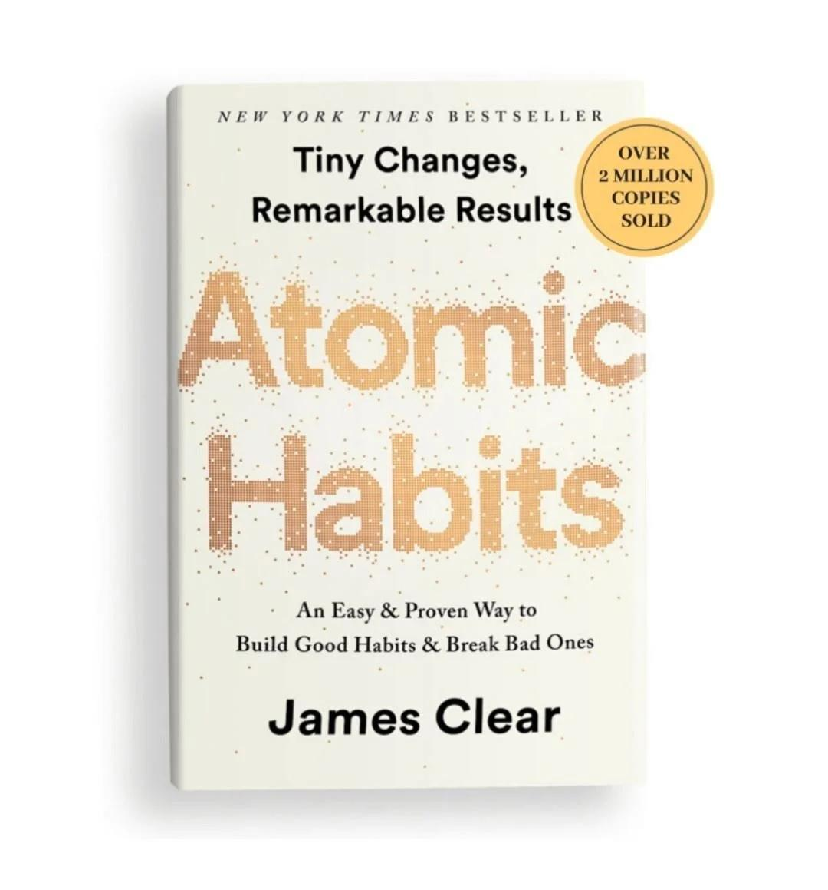

# Week 01 — Success Mindset (Mindset OS)

Part of the DevOps Micro Internship (DMI) Cohort 3 with Agentic AI

---

## Purpose (Read This First)

This week is not motivation homework.

This is you building your **Mindset OS** — the system you will use for the next 5 months (and honestly, for years).

### Expectations

* Be honest.
* Be specific.
* Be practical.
* Write like an adult professional: clear sentences, no one-liners.

You will reuse this in later weeks. So do it properly once.

---

# Assignment 1. What is something you believe to be true that most people around you would disagree with?

### Rules

* No "safe" answers.
* Must be your real belief (not copied from internet).
* Minimum 50 words.

**Hint:** What do you believe about career, money, learning, discipline, relationships, health, success, life, tech industry, etc. that most people don't agree with?

## Answer

One thing I believe that many people around me would disagree with is that being constantly busy is not the same as making real progress. Society often celebrates long hours, endless meetings, and always being “on,” but I think that focused work, clear priorities, and regular rest produce far better results. I’d rather spend two hours solving an important problem than ten hours looking productive. I believe success comes more from consistency, thoughtful decisions, and discipline than from simply working harder. Many people see slowing down as laziness, but I see it as creating space to think, learn, and make better choices.

---

# Assignment 2. What are the top 3 objective truths you discovered through experimentation and results?

### Definition

Objective truths do not depend on opinions. They hold true regardless of how people feel.

Write each truth in this format:

**Truth:** (1 sentence)

**Evidence from my life:** (2–4 lines: what you tried + what happened)

---

## Truth #1

### Truth

Consistency produces results.

### Evidence from my life

Even after just my first assignment, I can see that regular practice is more effective than trying to learn everything at once. Progress comes from showing up and learning a little every day.

---

## Truth #2

### Truth

    Small mistakes are part of the learning process.

### Evidence from my life

 I discovered that simple errors such as mistyping a command or misunderstanding a concept are valuable because troubleshooting them helps build confidence and understanding.

---

## Truth #3

### Truth

Hands-on practice teaches more than theory.

### Evidence from my life
 Reading about networking or DNS gave me a basic understanding, but actually completing assignments and working through practical exercises made the concepts much clearer.

---

# Assignment 3. What does your 2.0 version look like?

### Instructions

Write as if a journalist is writing about you **3 to 7 years from now** (not 20 years).

**Minimum 300 words.**

### Rules

* Write in past tense, like it already happened.
* Don't use "likes to / wants to / hopes to."
* Use specifics:

  * built
  * shipped
  * led
  * published
  * earned
  * relocated
  * contributed
* Include skills proof:

  * projects
  * portfolios
  * GitHub
  * blogs
  * certifications
  * job role
  * leadership
  * community contribution
* Add 1–3 images if you can (optional but powerful).

### Publish It Publicly On Any ONE

* LinkedIn
* Medium
* WordPress
* Blogspot
* Personal blog
* Portfolio page

Include this line:

> **P.S. This post is part of the DevOps Micro Internship (DMI) with Agentic AI — Cohort 3 — by [Pravin Mishra](https://www.linkedin.com/in/pravin-mishra-aws-trainer/). My graded progress is public: https://dmi.pravinmishra.com/s/YOUR-GITHUB-USERNAME.html · Start your DevOps journey: https://dmi.pravinmishra.com/?utm_source=student&utm_medium=ps-blog&utm_campaign=cohort3**

## Your Article

By the time many entrepreneurs are still talking about their vision, Clear Track Consult has quietly become one of the names associated with reliable legal verification and court intelligence in Nigeria. What began as a focused effort to improve access to verified court records has grown into a respected business serving law firms, multinational companies, financial institutions, and international background-screening partners.

Few would have predicted this trajectory. Just a few years earlier, the founder was balancing academic studies, navigating significant personal challenges, and building a business with limited resources but a clear sense of purpose. Rather than allowing setbacks to define the future, they became part of the foundation.

Today, Clear Track Consult is recognized for its professionalism in litigation history searches, divorce record verification, certified true copy (CTC) processing, and court document authentication. The company has developed strong operational relationships within the judicial system while maintaining a reputation for integrity, confidentiality, and compliance.

The firm’s client base now extends beyond Nigeria, with partnerships across the Middle East, Europe, and other African markets. What distinguishes Clear Track Consult is not only speed or access, but the confidence clients place in the accuracy of its reports. In an industry where trust is everything, that reputation has become its greatest asset.

Beyond business growth, the founder has emerged as a thoughtful voice on ethics, governance, and due diligence. Speaking at conferences and industry forums, they advocate for stronger verification standards and greater transparency in legal and corporate processes. Their insights are informed by practical experience rather than theory alone.

Those close to the journey describe a leader who is calmer, more disciplined, and more deliberate than in earlier years. The drive remains, but it is now accompanied by patience, strategic thinking, and an ability to build capable teams instead of carrying every responsibility alone.

Financially, the transformation is equally evident. The company has expanded its services, invested in technology, and created employment opportunities for professionals specializing in legal research, compliance, and investigations. Growth has been steady rather than explosive, reflecting a commitment to sustainable business practices.

Away from the office, the founder has become known for mentoring aspiring entrepreneurs and encouraging young professionals to build businesses rooted in integrity rather than shortcuts. Their story resonates because it is not one of overnight success, but of consistent progress through discipline, resilience, and continuous learning.

Perhaps the most remarkable change, however, is less visible. The person behind Clear Track Consult no longer measures success solely by revenue or recognition. Success is now defined by impact: helping clients make informed decisions, strengthening confidence in legal verification, and proving that credibility can be a competitive advantage.

Looking back, the challenges that once seemed overwhelming are now viewed as turning points. They did not disappear; they became the experiences that shaped a more resilient entrepreneur and a more grounded leader.

The next chapter for Clear Track Consult appears less about chasing opportunity and more about setting the standard for legal verification services across Africa. If current momentum continues, the company is well positioned to become one of the continent’s most trusted names in court records verification and due diligence.

### Public Link

Paste your link here:

`Add your URL here`

---

# Assignment 4. Have you ever cut corners (unethical / dishonest / shortcut behavior — not necessarily illegal)? If yes, how did it make you feel?

### Important

You don't need to write the full story.

Focus on the feeling:

* guilt
* fear
* shame
* stress
* regret
* numbness
* etc.

This is about self-awareness, not judgment.

### Answer Format

**Yes / No**

If Yes:

**What emotion did you feel?** (minimum 50–100 words)

## Answer

Yes, there were moments when I took shortcuts or acted in ways that didn’t fully align with the standards I wanted to live by. They may not have been illegal, but they weren’t consistent with the person I wanted to become.

At first, the decision seemed practical—faster, easier, or necessary under pressure. But the relief didn’t last. What remained was an uncomfortable feeling that I had compromised something more valuable than time or convenience: my integrity.

The regret wasn’t just about what I did; it was about realizing that I had acted below my own standards. Shame came from seeing the gap between who I believed I was and how I had behaved. Guilt lingered because I knew I could have chosen differently.

Those feelings were difficult to carry. They made every achievement earned through that shortcut feel less satisfying, because there was always a quiet reminder that it could have been done the right way. It wasn’t fear of being caught that hurt the most—it was disappointing myself.

Over time, those experiences became lessons rather than labels. They reinforced a simple truth: integrity is built in small decisions, especially when no one is watching. The regret, shame, and guilt were painful, but they also became the motivation to be more disciplined, more honest, and more intentional in every decision that followed.

---

# Assignment 5. What are 10 non-fiction books you plan to read in the next 1 year?

### Rules

* Mention **Title + Author**
* Any language allowed
* No fiction novels

### Tip

Choose books that improve:

* mindset
* communication
* productivity
* health
* money
* career
* leadership

## Book List

1. Atomic Habits By James Clear

2. Deep work by  Cal Newport
3. The Pyscology of money By Morgan Housel
4. The 7 habits of highly effective people By Stephen R. Covey
5. How to win friends and influnce people By Dale Carnegie
6. The Devops handbook By Gene Kim, Jez Humble, Patrick Debois & John Willis
7. The phoenix project By Gene Kim, Kevin Behr & George Spafford
8. Start with why By Simon Sinek
9. The lean startup By Eric Ries
10. Thinking, fast and slow By Daniel Kahneman

---

# Assignment 6. What are the things you will measure regularly in your life and career?

### Rules

List topics only. No need to share numbers.

### Must Include

* Learning / skill
* Output / proof
* Health / energy
* Time / focus
* Money / finance (personal or business)

### Example

* Learning hours per week
* Deep work sessions per week
* Projects shipped / documented
* Steps / workouts
* Sleep hours
* Spending tracker

## My Metrics

* Devops skills mastered
* Hands-on labs completed
* Assignments completed
* Projects built and documented
*  ⁠GitHub commits and repositories updated
*  ⁠Certificates earned
* Daily deep work sessions
* hysical exercise and workout
* Networking and professional connection
* ⁠Business income and expenses

---

# Assignment 7. Brain Dump + 5-Month System Plan

## Step 1: Brain Dump (Private)

Do a brain dump of everything in your mind into a notebook.

Examples:

* Bills
* Tasks
* Worries
* Goals
* Pending messages
* Ideas
* Responsibilities

### Did You Do It?

**Yes / No**

Answer:

yes

---

## Step 2: Your 5-Month Routine + Focus Blocks

Create a simple plan you can realistically follow for the next 5 months.

### Weekly Routine

Example:

* Mon–Thu: 60 min deep work
* Sat: DMI session
* Sun: Weekly review

#### My Weekly Routine

Monday: 60 min DMI deep work (Linux / terminal practice)
Tuesday: 60 min DMI assignment or lab practice
Wednesday: 60 min networking / cloud concepts
Thursday: 60 min hands-on practice + documentation
Friday: Light review (30 min) + organize notes
Saturday: DMI live session  project work (8 hrs)
Sunday: Weekly review, planning, and rest (45–60 min)

---

### Focus Blocks

#### When Will You Do DMI Work? (Days + Time)

Monday: 7:30 PM – 8:30 PM
Tuesday: 7:30 PM – 8:30 PM
Wednesday: 7:30 PM – 8:30 PM
Thursday: 7:30 PM – 8:30 PM
Saturday: 5:30 AM – 1:00 PM
Sunday: 6:00 PM – 7:00 PM (review only)

#### How Many Sessions Per Week?

Deep work sessions: 4
Live / practical session: 1
Weekly review session: 1
Total: 6 learning sessions per weekTotal: 6 learning sessions per week

---

### Distraction Rules

Examples:

* Phone rules
* Social media rules
* Environment setup

#### My Distraction Rules

during my learning time, my phine will be on DND

---

# Reflection – Week 1

### Biggest insight I got about myself this week

I can really do this if i keep focus

### My biggest weakness/loop I noticed

tired and my mind on my phone 

### One system I will implement from this week (exact habit + time)

making sure my phone is on DND

### LinkedIn Post

Paste your LinkedIn post link here:

`Add your URL here`

---

## 10. Proof of Work

- LinkedIn Post URL: **ADD LINK HERE**  
- Blog / Medium : **ADD LINK HERE**  

---

## 📌 About DMI & CloudAdvisory

DevOps Micro Internship (DMI) is a project-based DevOps program run by Pravin Mishra (The CloudAdvisory) focused on real-world execution, systems thinking, and career readiness.

It helps learners build strong DevOps foundations with hands-on experience.

## 📌 Resources

- 🌐 **DMI Official Website:** https://pravinmishra.com/dmi  
- 🎓 **DevOps for Beginners (Udemy):** https://www.udemy.com/course/devops-for-beginners-docker-k8s-cloud-cicd-4-projects/  
- 🎓 **Ultimate Agentic AI DevOps with Clude Code** https://www.udemy.com/course/ultimate-agentic-ai-devops-with-claude-code/?referralCode=448389767BC96284087B
- 🎓 **DevOps with Claude Code: Terraform, EKS, ArgoCD & Helm** https://www.udemy.com/course/devops-with-claude-code-terraform-eks-argocd-helm/?referralCode=1C5B734505D65A010FA3
- ▶️ **YouTube Playlist (DMI Cohort 3):** https://www.youtube.com/playlist?list=PLFeSNDtI4Cho  
- 🔗 **Pravin Mishra (LinkedIn):** https://www.linkedin.com/in/pravin-mishra-aws-trainer/  
- 🏢 **CloudAdvisory (LinkedIn):** https://www.linkedin.com/company/thecloudadvisory/

---

*This submission is part of DevOps Micro Internship (DMI) Cohort 3 — Agentic AI Track*